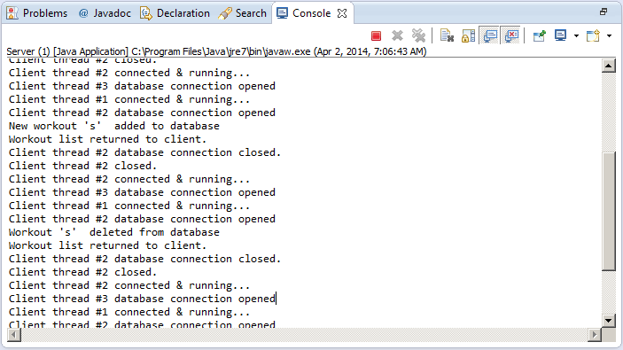
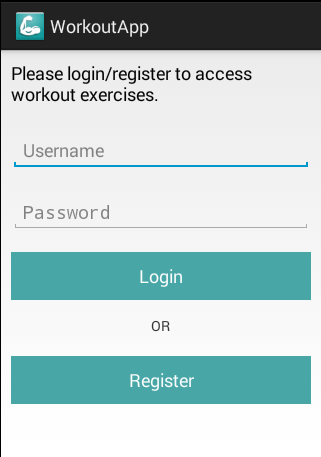

<h2>
	Description 
<h2>

	A simple Android 4.4 Workout app & a simple server demonstrating the client/server interactions using sockets. 

<h2>
	How to run
</h2>

<ul>
	<li>Import the a2_server & WorkoutApp into eclipse</li>
	<li>Run the a2_server as a 'Java Application' </li>
	<li>Launch the Adroid Virtual Device Manager</li>
	<li>Run the 'WorkoutApp' project as 'Android' application</li>
</ul>

<h2> Screenshots </h2>

<h3> Server </h3>

<h3> Login Page </h3>

